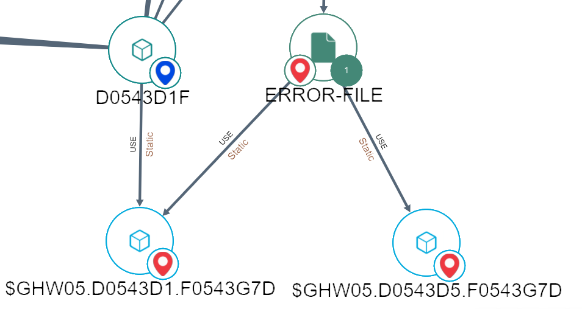

Welcome to the com.castsoftware.uc.obey wiki!

>Warning: The Extension described in this document is delivered as-is. This Extension is made available by CAST Labs Community and governed by Open Source License. Please consider all necessary steps to validate and to test the Extension in your environment before using it in production.        
The extension is published under GNU LGPL v3 open source license

***

# Table of content
- [Introduction](#introduction)
- [In what situation should you install this extension?](#situation)
- [CAST AIP versions compatibility](#aipcompatibility)
- [Supported DBMS servers](#supporteddbms)
- [Configuration instructions](#configuration)
- [Operation instructions](#Operation)
- [What results can you expect?](#expect)
   - [List of custom objects](#objects)
   - [List of links between custom objects](#links)
   - [Sample graphical view in CAST Imaging](#graphical)
   - [List of quality rules](#rules)
- [Known issues](#KnownIssues)
- [Approach used to support Obey](#approach)
- [Limitations and potential enhancements](#limitations)
- [Release Notes](#rn)

# Introduction 
This extension provides support for Obey files in HP NonStop Cobol applications.

Obey files are similar to JCL Jobs in the mainframe world. They are used to define the flow of a Cobol application.
Analyzing them can help to understand the end to end flow of a Cobol application.

Extension is Compatible with AIP Console.

# In what situation should you install this extension?
Whenever you need to analyze applications using Obey files in HP NonStop Cobol 
applications, if you want to get transactions / data call graph and representation of the actual physical files used to store data on disk, 
rather than just Cobol File Links, then you should use this extension.

Use cases covered:

- Knowledge Discovery / Blueprinting
- Transaction / Data Call Graph
- Identification of physical files used to store data on disk

# CAST AIP versions compatibility

This extension is compatible with all AIP versions from 8.3.0, and will be also in future versions.
It relies on UA and end_application to create links between Cobol and wfl artifacts.  
Furthermore, it has been tested with:    
- CAST AIP 8.3.54
- CAST AIP 8.3.56

# Supported DBMS servers

This extension is compatible with the following DBMS servers (hosting the Analysis Service):

| CAST AIP release       |                                      CSS3                                      |                                      CSS4                                      |                                  PG on Linux                                   |
|------------------------|:------------------------------------------------------------------------------:|:------------------------------------------------------------------------------:|:------------------------------------------------------------------------------:|
| All supported releases |  |  |  | 

# Configuration instructions
Package the Obey Source files with .obey file extension.

Once registered, this extension is integrated to the normal process of CAST analysis.

# Operation instructions

1. Install the extension manually, since the extension will not be automatically installed after a fast scan.
2. Obey files should be renamed with the .obey extension. 
This is required for the extension to work, as it uses the file extension to identify Obey files.
3. Create an analysis unit for the "Obey" extension.
4. If you want to get Transactions and Data Call Graphs, you need to create a new Transaction entry point for the **Obey Job** object and a new Data entity rule for the **Obey Physical File** object.

# What results can you expect?

Additional objects and links will be created in the knowledge base and will be available in CAST Imaging.

##  List of custom objects

- **Obey Job**: Represents the call graph entrypoint of the application, similar to JCL Jobs in the mainframe world.
- **Mainframe Unknown Program** : Represents a Cobol program that is called from an Obey Job but is not recognized. Indicates that the program is not part of the scan scope.
- **Obey Physical File**: Represents the physical files used to store data on disk.

## List of links between custom objects

- **Obey Job -> Mainframe Unknown Program**: Represents the call from an Obey Job to a Cobol program that is not recognized.

- **Obey Job -> Obey Physical File**: Represents the dependency from an Obey Job to a physical file. This dependency exists when an Obey Job assigns a physical file to a Cobol File Link and then calls a Cobol Program using this Cobol File Link.

- **Obey Job -> Cobol Program**: Represents the call from an Obey Job to a Cobol Program.

- **Cobol File Link -> Obey Physical File**: Represents the dependency from a Cobol File Link to a physical file. This dependency exists when a Cobol Program is being called from an Obey Job and the Obey Job assigns a physical file to a Cobol File Link being used by this particular Cobol Program.

## Sample graphical view in CAST Imaging

| Behavior without the extension                                         | Behavior with the extension                                               |
|------------------------------------------------------------------------|---------------------------------------------------------------------------|
|  |  |

## List of quality rules

- None

# Known issues

- None

## Approach used to support Obey

1. Analyze .obey files to identify the Obey Physical files, Cobol File Links and Cobol Programs being referenced
2. Create one Obey Job is created for each .obey file
3. Create one Obey Physical File object for each physical file being referenced in the Obey Job
4. Find the list of existing Cobol programs within the scan, and create one link between the Obey Job and each Cobol Program being called by the Obey Job
5. If a Cobol program being called is not part of the list of existing Cobol programs, create a Mainframe Unknown Program object and link it to the Obey Job 
6. For each existing Cobol Program (3) being called by an Obey Job, find the list of Cobol File Links being used by this program
7. For each of those Cobol File Link (6), find the list of Obey Physical Files being assigned to it in the Obey Job, and create one link between the Cobol File Link and the Obey Physical File
8. For each of those Cobol File Link (6), find the list of Obey Physical Files being assigned to it in the Obey Job, and Create one link between the Obey Job and the Obey Physical File

If we summarize:
- If Obey Job A calls Cobol Program B using Cobol File Link C, and Obey Job A assigns Obey Physical File D to Cobol File Link C, then:
  - Creation of Obey Job A
  - One link between Obey Job A and Obey Physical File D
  - One link between Obey Job A and Cobol Program B (if B is recognized, if not, a Mainframe Unknown Program object is created and linked to Obey Job A and we stop here)
  - If the Cobol Program B is recognized:
    - If Cobol File Link C is recognized because used within Cobol Program B, then:
      - One link between Cobol File Link C and Obey Physical File D
      

# Limitations and potential enhancements

- Obey Physical Files may show up in a transaction while they actually should not, because of the way CAST Imaging builds transactions and because of the way we link Cobol File Links to Obey Physical Files. Those Obey Physical File are easy to recognize though, they will not show any link with the Obey Job object entrypoint of the transaction.

In this example, the Obey file "$GH.DDG8.DASQX" should not appear in the transaction, as it is not linked to the Obey Job object entrypoint of the transaction. But since it is linked to a Cobol File Link which is part of the transaction and is an endpoint, it is included in the transaction.

- **Mainframe Unknown Program -> Obey Physical File**: this link will not be created, this will result in Obey Physical Files only being linked to Obey Jobs.
- **Unknown Cobol File Link**: All the Cobol File Links being used inside the Obey Jobs needs to be used inside the Cobol Program being called, if not, we will just ignore the Cobol File Link, example:
  - Obey Job A calls Cobol Program B using Cobol File Link C, and Obey Job A assigns Obey Physical File D to Cobol File Link C
    - If Cobol Program B is not recognized, then we will never find Cobol File Link C, in this case we could create an **Unknown Cobol File Link** but this is not something we are doing.
    - If Cobol Program B is recognized but does not use a Cobol File Link named C, in this case we could create an **Unknown Cobol File Link** but this is not something we are doing.
  - Creating those **Unknown Cobol File Link** could be possible technically. It would also allow us to create link between **Unknown Cobol File Link** and **Obey Physical File**, **Mainframe Unknown Program** or **Cobol Program**. 
- ReGex being used to identify statements within the .obey files may not be perfect and may identify false positives within comments

# Release Notes

## Version 1.0.54 Release Notes
* Initial version created by Cast Labs Community.
